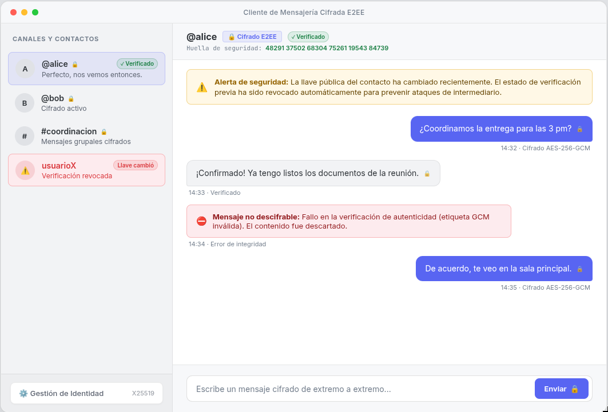
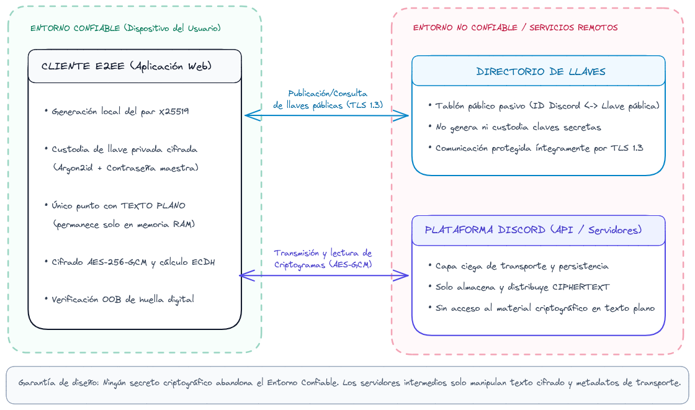
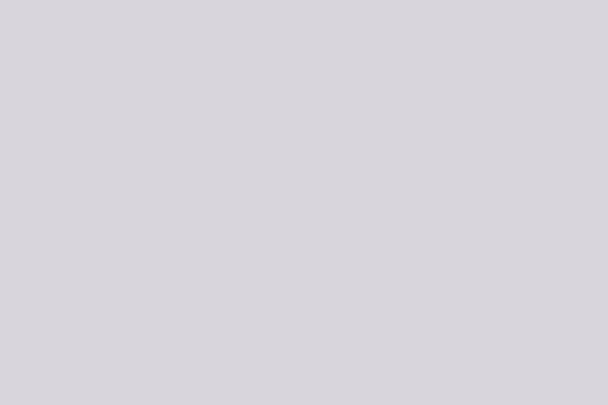
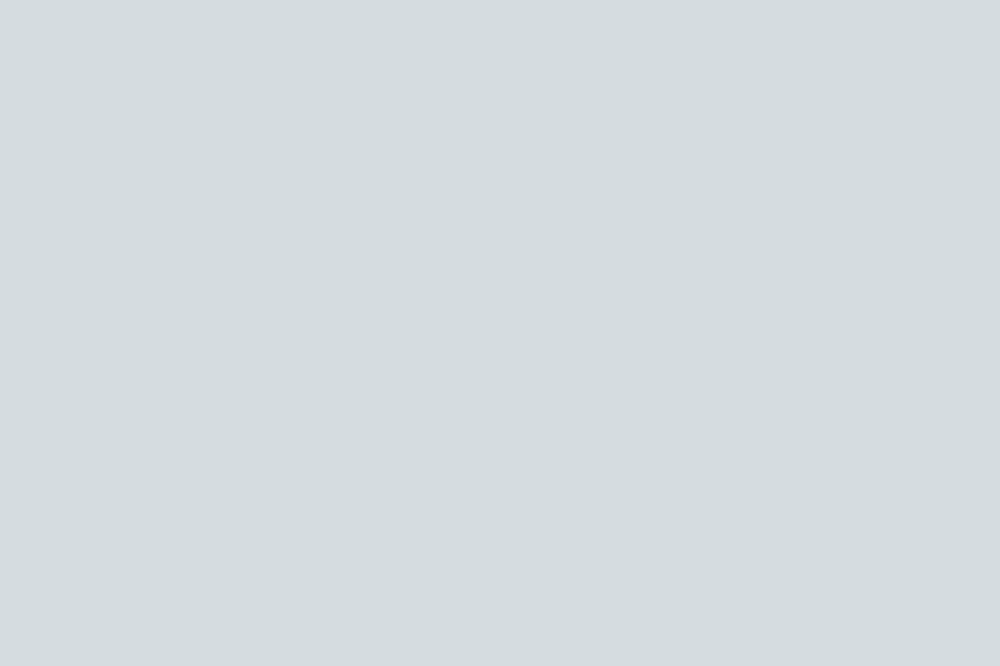
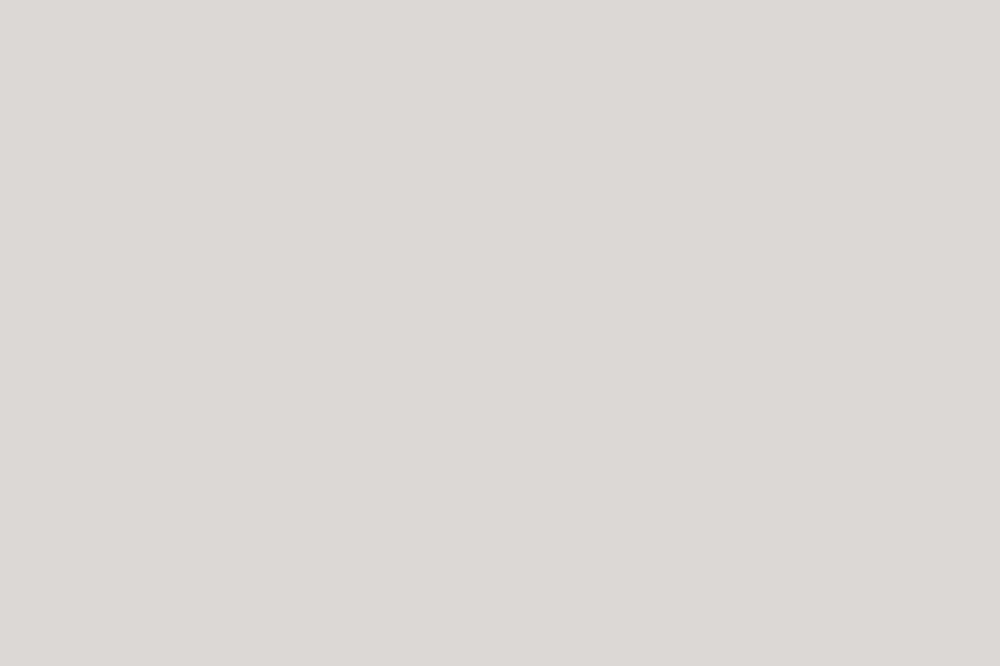

# Informe del Proyecto: Mensajería Cifrada en Discord

## 1. Motivación
En la actualidad, plataformas de comunicación masiva como Discord son utilizadas tanto para interacciones casuales como para coordinaciones profesionales y académicas. Sin embargo, Discord no ofrece cifrado de extremo a extremo (E2EE) por defecto para los mensajes directos o canales, lo que significa que la plataforma y sus servidores tienen acceso al contenido en texto plano de todas las comunicaciones. 

Este proyecto busca otorgar seguridad ante un problema observado en la vida real: la exposición de información confidencial (credenciales, propiedad intelectual, datos personales, etc) ante posibles brechas de datos en servidores de terceros o recolección masiva de datos. Al implementar una capa de cifrado sobre la API de Discord, garantizamos la confidencialidad e integridad de las conversaciones. De esta manera, las medidas de seguridad implementadas permiten al usuario hacer uso de su data y comunicarse a través de una plataforma popular sin sacrificar su derecho a la privacidad.

## 2. Trasfondo Teórico

Para comprender la arquitectura y las decisiones de seguridad de este proyecto, es fundamental definir los conceptos tecnológicos y criptográficos. Las tecnologías elegidas abordan directamente las vulnerabilidades de comunicaciones en red y aplican principios de seguridad defensiva.

* **Cifrado de Extremo a Extremo (E2EE):**
El E2EE es un paradigma de seguridad que garantiza que los mensajes permanezcan ininteligibles para cualquier entidad o proveedor de servicio, siendo descifrados exclusivamente por el emisor y el receptor previstos (Alatawi et al., 2023). En plataformas de mensajería estándar, el proveedor retiene el acceso al texto plano. Implementar E2EE permite resolver un problema observado en la vida real: la falta de privacidad en plataformas de terceros. Garantiza que los mensajes se encripten en el cliente antes de ser enviados al servidor para su transmisión, asegurando que ante cualquier fuga de datos en el servidor, los atacantes solo obtengan texto cifrado inservible (Park et al., 2023).

* **Criptografía Híbrida:**
Como se abordo en clase, depender de un solo tipo de algoritmo es ineficiente para aplicaciones de mensajería. Por lo cual para este proyecto se va usar el esquema híbrido:

    * **Cifrado Simétrico (AES-GCM):** AES (Advanced Encryption Standard) es el estándar académico e industrial para cifrar el contenido del mensaje en sí, justificado por su altísima eficiencia computacional al procesar grandes volúmenes de datos (Garg et al., 2024). Se emplea la modalidad GCM (Galois/Counter Mode) porque proporciona simultáneamente confidencialidad e integridad, mitigando intentos de alteración del mensaje en tránsito.

    * **Criptografía de Llave Pública (RSA/ECC):** Algoritmos como RSA o la Criptografía de Curva Elíptica (ECC) son esenciales para la distribución segura de llaves sin requerir un encuentro físico previo. En el proyecto, la criptografía asimétrica no cifra el mensaje largo, sino que se utiliza para cifrar y compartir de manera segura la clave simétrica (AES) generada de forma única para cada sesión. ECC suele preferirse sobre RSA clásico por ofrecer un nivel de seguridad equivalente con tamaños de llave mucho menores, optimizando el rendimiento web.

* **Discord API y OAuth**: Interfaces que permiten la interacción programática con la plataforma. Se requerirá el uso de OAuth o tokens de bot para hacer uso de la API y poder interceptar, enviar y leer mensajes.

* **Infraestructura y Manejo de Claves (Key Management):**
El manejo de llaves es el componente más crítico y vulnerable en cualquier sistema E2EE. La literatura advierte que, si un atacante compromete la infraestructura de distribución, la encriptación entera colapsa.

    * **El desafío (Vulnerabilidad Centralizada):** Tradicionalmente, se utiliza una Infraestructura de Clave Pública (PKI) basada en Autoridades Certificadoras (CA) centralizadas. Sin embargo, en E2EE, depender de un servidor centralizado administrado por un tercero para distribuir llaves públicas introduce un punto único de fallo (Park et al., 2023). Un servidor comprometido podría perpetrar un "ataque de sustitución de llaves", entregando la llave de un atacante en lugar de la del receptor legítimo (Alatawi et al., 2023).

    * **Alternativa: :** Para evitar este riesgo, el diseño propone descentralizar la confianza. El servidor backend actuará únicamente como un directorio pasivo (un tablón de anuncios) para la distribución de llaves públicas. Las llaves privadas nunca abandonarán el dispositivo; se asegurará que la data guardada permanezca en *plaintext* solo por un período corto de tiempo en memoria, y si se guarda en disco local, estará protegida mediante encriptación con una contraseña maestra.

* **Autenticación y Protección contra ataques Man-in-the-Middle (MitM):**
Para evitar el ataque de sustitución de llaves mencionado anteriormente, la criptografía por sí sola no es suficiente; se requiere certificar la identidad de los extremos.

    * **Autenticación Fuera de Banda (Out-of-Band - OOB):** Este es un requisito de diseño crítico para asegurar la integridad del E2EE. La autenticación OOB implica utilizar un canal secundario, completamente independiente al medio principal (Discord), para verificar las identidades (Naor et al., 2018).

    * **Implementación:** Siguiendo el estado del arte de aplicaciones como Signal o WhatsApp, los usuarios deberán someterse a una "Ceremonia de Autenticación" (Alatawi et al., 2023). Esto significa que la aplicación generará una huella digital (hash) criptográfica de la llave pública. Los usuarios deberán comparar este hash a través de una llamada telefónica, enviándolo por SMS, o escaneando un código QR en persona. Al corroborar que los hashes coinciden fuera de la red de Discord, se garantiza matemáticamente que ninguna entidad intermedia ha manipulado las llaves.

## 3. Requerimientos

El proyecto tiene como fin crear una capa de seguridad en la comunicación de texto de **Discord**. Los requerimientos se derivan del siguiente modelo de amenaza.

**Modelo de amenaza**: Para el proveedor de la plataforma de **Discord** y cualquier entidad con acceso a sus servidores, se considera como adversario a un atacante pasivo y activo en la red. Se asume que es confiable el dispositivo del usuario y el sistema operativo del cliente. Queda **fuera del alcance** la protección de los metadatos, la disponibiliad del servicio y el compromiso físico del endpoint.

Para entender la distinción entre atacante pasivo y activo, se usa la definición de Dolev y Yao (1983) que menciona que la diferencia entre ambos es lo **qué puede hacer con los mensajes que ve**. El pasivo solo observa, lee, copia y almacena. En cambio, el activo puede modificar un mensaje, borrarlo, retrasarlo, reordenarlo, editarlo, etc.

Para enfocar esta distinción se ilustra esas diferencias bajo el trabajo realizado en la siguiente tabla.

| Actor | Atacante pasivo | Atacante activo |
|---    |---              |---              |
| **Discord / proveedor** | Lee el contenido de los DMs y canales; conserva el historial en sus bases de datos; lo entrega ante requerimiento legal o lo pierde en una brecha | Podría alterar mensajes en tránsito o inyectar contenido falso atribuido a un usuario |
| **Red** | Captura tráfico en una WiFi abierta o en un nodo intermedio | Se interpone en la conexión con el directorio de llaves y responde en su lugar |
| **Directorio de llaves** | Un volcado de su base de datos revela qué usuarios se registraron y cuándo| **Sustitución de llaves:** devuelve la llave pública del atacante en lugar de la del receptor legítimo |

### 3.1. Requerimientos Funcionales
* **RF1:** El sistema debe generar localmente, en el dispositivo del usario, un par de llaves asimétricas de identidad durante el registro inicial.

* **RF2:** El sistema debe publicar la llave del usuario en un directorio de llaves, permitiendo a otras personas obtener esa llave con el identificador de su cuenta de Discord.

* **RF3:** El sistema debe cifrar con una llave simétrica cada mensaje antes de ser enviado por la API de Discord.

* **RF4:** El sistema debe poder encapsular la clave de sesión mediante una criptografía de llave pública, de modo que solo el destinatario previsto pueda recuperarla.

* **RF5:** El sistema debe detectar y descifrar automáticamente los mensajes entrantes dirigidos al usuario, mostrando el texto plano únicamente en la interfaz local.

* **RF6:** El sistema debe generar y mostrar una huella digital criptográfica derivada de las llaves públicas de ambos interlocutores.

* **RF7:** El usuario podrá marcar un contacto como _verificado_ tras completar el proceso de autentiación fuera del canal.

* **RF8:** El sistema debe notificar al usuario cuando la llave pública registrada de un contact ya _verificado_ cambie y revocar automaticamente su estado de verificación.

* **RF9:** El sistema debe indicar visualmente, por cada conversación, si el canal esta cifrado y si la contraparte está verificada.

* **RF10:** El sistema debe autenticarse frente a Discord mediante OAuth2 o token de bot, sin exponer esas credenciales en la interfaz.

* **RF11:** El sistema debe permitir identificar un mensaje que no se pueda descifrar.

* **RF12:** El usuario podra exportar e importar su identidad criptográfica para usarla en otro dispositivo , protegido por su contraseña maestra.

### 3.2. Requerimientos de Seguridad

* **RS1:** La llave privada del usuario debe permanecer en el sistema y no ser transmitido a algun tercero.

* **RS2:** La llave privada en el dispositivo debe estar cifrada con una clave derivada de la contraseña maestra con **Argon2id** y con _salt_ unico por usaurio.

* **RS3:** El texto plano debe permanecer en memoria el menor tiempo posible y no debe escribirse ni en registros ni archivos temporales.

* **RS4:** Todo cifrado simétrico debe emplear AES-256 en modo GCM, con un _nonce_ de 96 bits generado por un CSPRNG del sistea operativo y jamás reutilizado bajo la misma clave.

* **RS5:** El sistema debe rechazar todo mensaje cuya etiqueta de autentiación GCM no se válida.

* **RS6:** La comunicación entre el cliente y el directorio de llaves debe realizarse sobre TLS 1.3, como defensa frente a un atacante en la red.

* **RS7:** El proceso de verificación de un usuario debe ser fuera del canal de Discord.

* **RS8:** La huella digital de verificación debe derivarse de las llaves públicas de ambas partes mediante una función hash (SHA-256), con un orden determinístico que produzca el mismo valor en ambos extremos.

* **RS9:** Las claves de sesión deben rotarse periodicamente.

* **RS10:** Los tokens de acceso a la API de Discord deben gestionarse en variables de entorno.

* **RS11:** Todo el material criptográfico debe provenir de un generado de números aleatorios (pseudo-aleatorios) criptográficamente seguro.

## 4. Diseño

El diseño se aborda desde dos aristas complementarias. El **diseño funcional** define la interfaz y la experiencia de usuario que materializa los requerimientos funcionales; el **diseño de seguridad** especifica los algoritmos y los protocolos que hacen cumplibles los requerimientos de seguridad.

### 4.1 Diseño funcional: interfaz y experiencia de usuario

El cliente se implementa como una página web independiente del cliente oficial de Discord (véase 5.4). Su interfaz se organiza en cinco vistas, cada una vinculada a uno o más requerimientos funcionales:

| Vista | Descripción | Requerimientos |
|---    |---          |---              |
| **Autenticación** | El usuario inicia sesión con su cuenta de Discord mediante OAuth2 o token de bot; las credenciales se gestionan en variables de entorno y nunca se exponen en la interfaz | RF10, RS10 |
| **Registro de identidad** | Tras el primer ingreso, se genera el par de llaves X25519 en el dispositivo y se solicita la contraseña maestra para proteger la llave privada | RF1 |
| **Gestión de identidad** | Permite exportar e importar la identidad criptográfica, siempre protegida por la contraseña maestra | RF12 |
| **Lista de conversaciones** | Agrupa los canales del usuario y muestra, por cada conversación, si está cifrada y si la contraparte está verificada | RF9 |
| **Conversación cifrada** | Concentra el flujo de mensajes: el texto plano se descifra en memoria y se muestra únicamente aquí, sin persistirse en disco ni en registros | RF5, RS3 |
| **Panel de verificación** | Presenta la huella digital y guía la ceremonia de autenticación fuera de banda | RF6, RF7 |

Para apoyar los RF7, RF8, RF9 y RF11, la interfaz incorpora los siguientes indicadores de estado por conversación:

* **Candado cerrado:** la conversación opera bajo el esquema de cifrado descrito en 3.2.3.
* **Insignia de verificación:** la contraparte completó la autenticación fuera del canal de Discord.
* **Alerta de cambio de llave:** si la llave pública registrada de un contacto *verificado* cambia, el cliente revoca automáticamente la verificación y notifica al usuario.
* **Marcador "mensaje no descifrable":** se reserva para los mensajes entrantes que no pueden autenticarse o descifrarse.

El siguiente Wireframe ilustra una conversación con estos indicadores.

| Elemento de interfaz | Requerimientos |
|---    |---              |
| Indicador de cifrado (candado) por conversación | RF3, RF9 |
| Insignia de contacto verificado | RF7, RF9 |
| Alerta y revocación automática de verificación | RF8 |
| Marcador "mensaje no descifrable" | RF11 |
| Vistas de autenticación, registro y gestión de identidad | RF1, RF2, RF10, RF12 |

### 4.2 Diseño de seguridad: algoritmos y protocolos

El diseño de seguridad combina la criptografía híbrida presentada en la sección 2 (AES-256-GCM para el contenido y X25519/ECDH para el intercambio de claves) con protocolos que preservan la descentralización de la confianza. A continuación se describen los cuatro protocolos que implementan los requerimientos de seguridad.

#### 4.2.1 Arquitectura y límite de confianza

El sistema se compone de tres elementos: el **cliente**, único punto donde existe texto plano; el **directorio de llaves**, tablón pasivo que asocia identificadores de Discord a llaves públicas; y **Discord**, que transporta y persiste únicamente *ciphertext*. La comunicación entre el cliente y el directorio se protege con TLS 1.3 (RS6), neutralizando a un atacante activo en la red que intente interponerse en la descarga de llaves.

#### 4.2.2 Registro y custodia de la identidad

El diseño de manejo de llaves aborda directamente la vulnerabilidad centralizada descrita en 2. Durante el registro, el cliente genera el par X25519 **en el dispositivo** (RF1). La llave privada se cifra con una clave derivada de la contraseña maestra mediante **Argon2id** con *salt* único por usuario (RS2) y jamás abandona el dispositivo (RS1); la llave pública se publica en el directorio asociada al identificador de Discord (RF2), de modo que el directorio nunca custodia material secreto.

**Figura 4.3.** *Registro: generación local del par X25519, cifrado de la llave privada con Argon2id + contraseña maestra y publicación de la llave pública en el directorio.*

#### 4.2.3 Protocolo de mensajería

El protocolo de mensajería implementa el esquema criptográfico concreto de 5.2:

1. **Envío.** El emisor genera un par efímero X25519 por mensaje y calcula el secreto compartido por **ECDH** contra la llave pública de identidad del receptor (RF4).
2. **Derivación.** El secreto se procesa con **HKDF-SHA256** para derivar la clave de sesión AES-256 (RF3).
3. **Cifrado.** El contenido se cifra con **AES-256-GCM**, usando como datos autenticados adicionales (AAD) los identificadores de emisor y receptor, lo que ata el criptograma a su contexto (RF3, RS4). El *nonce* de 96 bits proviene del CSPRNG del sistema operativo y jamás se reutiliza bajo la misma clave (RS4, RS11).
4. **Transmisión.** El criptograma viaja por la API de Discord hasta el receptor.
5. **Descarte.** La llave efímera se descarta tras el envío, de modo que el compromiso posterior de la llave de identidad no permite descifrar mensajes ya enviados (forward secrecy) (RS9).
6. **Recepción.** El receptor extrae la llave efímera del mensaje, recupera el mismo secreto por ECDH, deriva la misma clave y descifra **verificando la etiqueta de autenticación GCM**; cualquier mensaje cuya etiqueta no valide es rechazado y marcado como no descifrable (RF5, RF11, RS5). El texto plano permanece en memoria el menor tiempo posible (RS3).

**Figura 3.4.** *Protocolo de mensajería: ECDH efímero, HKDF-SHA256, AES-256-GCM con AAD y descarte de la llave efímera.*

#### 4.2.4 Ceremonia de verificación

La ceremonia de verificación ofrece protección contra el ataque de sustitución de llaves (RS7). Ambos extremos calculan la huella digital `SHA-256(pk_A || pk_B)` con las llaves ordenadas lexicográficamente (RS8), presentada truncada a 60 dígitos decimales en grupos de cinco. Los usuarios comparan esas huellas **fuera del canal de Discord** (llamada, presencia o código QR). Solo entonces el cliente persiste el estado de *verificado* junto con un *pin* de la llave pública (RF7); si la llave cambia posteriormente, el *pin* permite detectar la discrepancia, revocar la verificación y alertar al usuario (RF8).

**Figura 3.5.** *Ceremonia de verificación: cálculo de la huella en ambos extremos, comparación fuera de banda y persistencia del estado verificado con pin de llave.*

| Protocolo / componente | Requerimientos |
|---    |---              |
| Cadena ECDH + HKDF-SHA256 + AES-256-GCM | RF3, RF4, RF5, RS4, RS5 |
| Dato autenticado adicional (AAD) con identificadores | RF3, RS4 |
| Descarte de la llave efímera por mensaje | RS9 |
| Generación local y custodia cifrada de la llave privada | RF1, RF12, RS1, RS2 |
| Texto plano solo en memoria | RS3 |
| TLS 1.3 entre cliente y directorio de llaves | RS6 |
| Huella SHA-256 y ceremonia fuera de banda | RF6, RF7, RF8, RS7, RS8 |
| CSPRNG del sistema operativo | RS4, RS11 |

## 5. Implementación Propuesta

### 5.1 Arquitectura general

El proyecto se compone de tres elementos. El **cliente** concentra toda la lógica criptográfica y es el único punto donde existe el _plain text_. El **directorio de llaves** es un servicio propio que va a almacenar los pares (identificador **Discord** -> llave pública). Por último **Discord**, actúa exclusivamente como una capa de transporte de los mesnajes y la persistencia de estos.

### 5.2 Esquema criptográfico concreto

1. Cada usaurio posee una llave de identidad de curva elíptica X25519

2. Para cada mensaje, el emisor genera un par efímero X25519 y calcula un secreto copartido por ECDH contra la llave pública de indentidad del receptor.

3. El secreto se pasas por HKDF-SHA256 para derivar la clave de sesión AES-256.

4. El contendio se cifra con AES-256-GCM, usando datos adicionales autenticados los identificadores de emisor y receptor, lo que permite relacionar el criptograma a su contexto.

5. Se descarta la clave efímera, de modo que el compromiso posterior de la llave de identidad no permite descrifrar los mensajes ya enviadas.

### 5.3 Proceso de verificación

La huella digital se calcula como `SHA-256(pk_A || pk_B)` con las llaves ordenadas lexicográficamente, y se presenta truncada a 60 dígitos decimales agrupos de cinco en cinco, siguiendo el patrón de los _safety numbers_ de Signal.
Luego los usuarios la comparan por llamada telefónica, presencialmente o escanenado el QR del otro dispositivo. Solo entonces el cliente persiste el estado de "verificado" junto con un _pin_ de la llave pública, que habilita la alerta de RF9.

### 5.4 Tecnologías

* **Cliente:** Python 3.12 con `discord.py` para la API y la biblioteca `cryptography`.

* **Derivación de contraseña maestra:** `argon2-cffi`

* **Interfaz:** Pagina web idependeinte al cliente oficial de Discord

* **Directorio de llaves:** FastAPI + PostgreSQL.

* **Control de secretos y versiones:** Git con `.env` excluido y variables de entorno en despliegue.

### 5.5 Fases de ejecución

1. **Núcleo criptográfico aislado:** Implementar el cifrado/descrifrado y la derivación de claves.

2. **Almacén local de identidad:** Generación de llaves, cifrado con contraseña maestra, exportación e importación.

3. **Dirección de llaves:** Servicio, esquema de datos y cliente HTTPS.

4. **Integración con Discord:** Envío y recepción de mensajes.

5. **Proceso de verificación:** Huellas digirales, QR, indicadores de estado y alertas de cambio de clave.

### 5.6 Limitaciones reconocidas

El sistema protege el contenido, no el patrón de comunicación que se realiza a través de la API de **Discord**.
 
---

### Referencias Bibliográficas

* Park, Y., Yoo, H., Ryu, J., Choi, Y.-R., Kang, J.-S., & Yeom, Y. (2023). End-to-end post-quantum cryptography encryption protocol for video conferencing system based on government public key infrastructure. Applied System Innovation. https://doi.org/10.3390/asi6040066

* Garg, P., Gupta, A., Singh, Y. P., & Goyal, P. (2026). End-to-end encryption: Evolution, barriers, and emerging trends. https://doi.org/10.1007/978-981-95-1683-4_8

* Alatawi, M., & Saxena, N. (2023). SoK: An analysis of end-to-end encryption and authentication ceremonies in secure messaging systems. En Proceedings of the 16th ACM Conference on Security and Privacy in Wireless and Mobile Networks (pp. 187–201). ACM. https://doi.org/10.1145/3558482.3581773 

* Naor, M., Rotem, L., & Segev, G. (2018). The security of lazy users in out-of-band authentication (IACR Cryptology ePrint 2018/823). IACR. https://eprint.iacr.org/2018/823

* Dolev, D., & Yao, A. C. (1983). On the security of public key protocols. IEEE Transactions on Information Theory, 29(2), 198–208. https://doi.org/10.1109/TIT.1983.1056650